# 🚦 Framework Multimodal para el Análisis de Accidentes de Tráfico

> **Construcción del Dataset · Entrenamiento por Fases · Configuración de Rendimiento y Robustez mediante el Protocolo Híbrido MCDM-MODM**

[](https://www.python.org/)
[](https://pytorch.org/)
[](https://developer.nvidia.com/cuda-toolkit)
[](LICENSE)
[](README.md)

---

## 📋 Tabla de Contenidos

- [Descripción](#-descripción)
- [Arquitectura del Framework](#-arquitectura-del-framework)
- [Requisitos del Sistema](#-requisitos-del-sistema)
- [Instalación de Dependencias](#-instalación-de-dependencias)
- [Estructura del Proyecto](#-estructura-del-proyecto)
- [Uso — Diagnóstico por Fases](#-uso--diagnóstico-por-fases)
- [Uso — Suite Multiobjetivo MCDM-MODM](#-uso--suite-multiobjetivo-mcdm-modm)
- [Uso — Visualización CSV](#-uso--visualización-csv)
- [Capturas de Pantalla](#-capturas-de-pantalla)
- [Resultados Obtenidos](#-resultados-obtenidos)
- [Dataset DSM](#-dataset-dsm)
- [Protocolo Híbrido MCDM-MODM](#-protocolo-híbrido-mcdm-modm)
- [Referencia Académica](#-referencia-académica)

---

## 📖 Descripción

Este repositorio contiene el código fuente y los scripts de evaluación de la investigación doctoral:

> *"Framework Multimodal para el Análisis de Accidentes de Tráfico: Construcción del Dataset, Entrenamiento por Fases y Configuración de Rendimiento y Robustez mediante el Protocolo Híbrido MCDM-MODM"*

El framework integra cuatro fases de procesamiento en un pipeline multimodal que transforma imágenes de accidentes de tráfico vehicular en reportes forenses automatizados:

| Fase | Componente | Modelos candidatos | Métrica principal |
|------|-----------|-------------------|-------------------|
| **F1** | Detección de objetos | YOLOv11s | mAP@50 |
| **F2** | Clasificación de escenas | Swin · ViT · ResNet50 · InceptionV3 · YOLO11-cls | F1-macro |
| **F3** | Descripción VLM | Qwen2-VL base/highcap · LLaVA-Next base/highcap | BERTScore |
| **F4** | Reporte LLM forense | Mistral-7B base/highcap · Qwen2-7B base/highcap | BERTScore |

El **Protocolo Híbrido MCDM-MODM** evalúa las **320 configuraciones** del producto cartesiano F1×F2×F3×F4 mediante 7 métodos de decisión multicriterio e identifica la configuración óptima **S1** y robusta **S2** del pipeline.

**Configuración óptima identificada (S1):**
```
combo_002 + Swin + qwen2vl_highcap + mistral_highcap
BERTScore = 0.8353  |  Consensus V2 > 0.95
```

---

## 🏗️ Arquitectura del Framework

```
┌─────────────────────────────────────────────────────────────────┐
│                    FRAMEWORK MULTIMODAL                         │
│                                                                 │
│  Imagen de ──► F1 Detección ──► F2 Clasificación ──► F3 VLM   │
│  accidente      YOLOv11s         Swin/ViT/...        Qwen2-VL  │
│                 (mAP@50)         (F1-macro)          (BERTScore)│
│                                                         │       │
│                                                         ▼       │
│                                                     F4 LLM      │
│                                                     Mistral-7B  │
│                                                     (Reporte    │
│                                                      forense)  │
│                                                         │       │
│                                                         ▼       │
│                     ┌─────────────────────────────────────┐    │
│                     │   Protocolo Híbrido MCDM-MODM       │    │
│                     │  320 configs · 7 métodos · 6 pasos  │    │
│                     │    S1 (óptima) · S2 (robusta)       │    │
│                     └─────────────────────────────────────┘    │
└─────────────────────────────────────────────────────────────────┘
```

---

## 💻 Requisitos del Sistema

| Componente | Mínimo | Recomendado (investigación) |
|-----------|--------|---------------------------|
| GPU | 1× NVIDIA 16 GB VRAM | 3× NVIDIA RTX A4500 (60 GB total) |
| RAM | 32 GB | 64 GB |
| Almacenamiento | 100 GB SSD | 500 GB NVMe |
| CUDA | 11.8+ | 12.1+ |
| Python | 3.10+ | 3.11 |
| SO | Ubuntu 20.04+ | Ubuntu 22.04 |

---

## 🔧 Instalación de Dependencias

### Paso 1 — Ejecutar el script de instalación

El script `librerias.sh` instala todas las dependencias necesarias del sistema y de Python:

```bash
# Otorgar permisos de ejecución
chmod +x librerias.sh

# Ejecutar instalación completa (requiere privilegios root)
bash librerias.sh
```

**El script instala automáticamente:**

| Categoría | Paquetes |
|-----------|---------|
| Sistema | `vim`, `nvtop` |
| Visión por computador | `ultralytics`, `timm`, `torchvision` |
| NLP / Transformers | `transformers`, `peft`, `nltk`, `rouge_score` |
| Métricas de evaluación | `bert-score`, `mauve-text` |
| Aceleración | `flash-attn` (sin aislamiento de build) |
| Utilidades | `GPUtil`, `seaborn`, `tqdm`, `scikit-learn`, `csvkit` |
| Tokenización | `sentencepiece`, `tiktoken`, `protobuf` |

```bash
# Verificar instalación correcta
python3 -c "import torch; print(f'PyTorch: {torch.__version__}'); print(f'CUDA: {torch.cuda.is_available()}'); print(f'GPUs: {torch.cuda.device_count()}')"
```

### Paso 2 — Configurar límites del sistema

```bash
# Aumentar límite de descriptores de archivo
ulimit -n 131072
ulimit -a
```

### Paso 3 — Descargar recursos NLTK

```bash
python3 -c "import nltk; nltk.download('wordnet'); nltk.download('omw-1.4'); nltk.download('punkt')"
```
### Descargar recursos Dataset Multimodal
https://drive.google.com/drive/folders/1XVuiN2GVj1LWmf8450jRN5kozKKP11f9?usp=drive_link
---

## 📁 Estructura del Proyecto

```
framework-multimodal-trafico/
│
├── fases_diagnostic_validation_full_trace.py   ← Pipeline evaluación por fases
├── multiobjective_suite.py                     ← Suite MCDM-MODM (TUI interactiva)
├── csvreporte.sh                               ← Visualizador de resultados CSV
├── librerias.sh                                ← Instalador de dependencias
│
├── /workspace/
│   ├── dataset_labeled_split/                  ← Dataset DSM anotado
│   │   ├── train/images/
│   │   ├── val/images/
│   │   └── test/images/
│   ├── DSM/images/                             ← Imágenes por categoría
│   │   ├── accidente/      (aprox. 1229 imágenes)
│   │   ├── fuego/          (aprox. 1262 imágenes)
│   │   ├── trafico_denso/  (aprox. 1051 imágenes)
│   │   └── trafico_escaso/ (aprox. 1275 imágenes)
│   └── diagnostic_results/                     ← Resultados generados
│       ├── fases_results_YYYYMMDD_HHMMSS.csv
│       └── fases_trace_log_YYYYMMDD_HHMMSS.txt
│
└── multiobjective_db.json                      ← BD configuraciones y runs (auto)
```

---

## 🚀 Uso — Diagnóstico por Fases

**Archivo:** `fases_diagnostic_validation_full_trace.py`

Este script ejecuta el pipeline de evaluación multimodal por fases seleccionables sobre el Dataset DSM.

### Modos de ejecución

```bash
# MODO INTERACTIVO (menú de selección)
python fases_diagnostic_validation_full_trace.py

# MODO DIRECTO — Una fase (1 GPU)
python fases_diagnostic_validation_full_trace.py --phase F1      # Solo Detección
python fases_diagnostic_validation_full_trace.py --phase F2      # Solo Clasificación
python fases_diagnostic_validation_full_trace.py --phase F3      # Solo VLM
python fases_diagnostic_validation_full_trace.py --phase F4      # Solo LLM

# MODO DIRECTO — Dos fases (2 GPUs)
python fases_diagnostic_validation_full_trace.py --phase F1F2    # Det + Cls
python fases_diagnostic_validation_full_trace.py --phase F1F3    # Det + VLM
python fases_diagnostic_validation_full_trace.py --phase F2F3    # Cls + VLM
python fases_diagnostic_validation_full_trace.py --phase F2F4    # Cls + LLM
python fases_diagnostic_validation_full_trace.py --phase F3F4    # VLM-GPU0 | LLM-GPU1

# MODO DIRECTO — Tres fases (2 GPUs)
python fases_diagnostic_validation_full_trace.py --phase F1F2F3  # Det+Cls-GPU0 | VLM-GPU1
python fases_diagnostic_validation_full_trace.py --phase F1F2F4  # Det+Cls-GPU0 | LLM-GPU1
python fases_diagnostic_validation_full_trace.py --phase F2F3F4  # F1+VLM-GPU0 | LLM-GPU1

# PIPELINE COMPLETO (2 GPUs) — genera las 320 combinaciones
python fases_diagnostic_validation_full_trace.py --phase F1F2F3F4

# CON DIRECTORIO DE SALIDA PERSONALIZADO
python fases_diagnostic_validation_full_trace.py \
    --phase F1F2F3F4 \
    --output-dir /workspace/diagnostic_results
```

### Parámetros disponibles

| Parámetro | Tipo | Default | Descripción |
|-----------|------|---------|-------------|
| `--phase` | str | `None` | Modo de fases (F1, F1F2, F1F2F3F4...). Sin argumento → menú interactivo |
| `--output-dir` | str | `/workspace/diagnostic_results` | Directorio de salida para CSV y logs |

### Flujo de ejecución interactivo (3 menús)

**Menú 1 — Selección de modo de fases:**
```
── UNA FASE — GPU 0 ──
1. F1    Solo Detección
2. F2    Solo Clasificación
3. F3    Solo VLM
4. F4    Solo LLM

── DOS FASES ──
5. F1F2   Det + Cls [GPU 0]
6. F1F3   Det + VLM [GPU 0]
...
10. F3F4  VLM-GPU0 | LLM-GPU1

── TRES FASES (2 GPUs) ──
11. F1F2F3   Det+Cls-GPU0 | VLM-GPU1
...

── CUATRO FASES / PIPELINE COMPLETO (2 GPUs) ──
13. F1F2F3F4  F1+VLM-GPU0 | F2+LLM-GPU1

► Elegir opción (número o código, ej: 5 ó F1F2):
```

**Menú 2 — Selección de imágenes:**
```
1. Dataset plano — /workspace/dataset_labeled_split/test/images
2. Dataset DSM   — /workspace/DSM/images/{categoria}
   N imágenes por categoría automáticamente

► Opción (1/2): 2
► ¿Cuántas imágenes por categoría? (número, Enter=todas): 100
```

**Menú 3 — Selección de modelos por fase:**
```
VLM (F3) — 4 disponibles:
  1. qwen2vl_base      /workspace/models/vlm/qwen2vl/base_model
  2. qwen2vl_highcap   /workspace/models/vlm/qwen2vl/base_model + LoRA
  3. llavanext_base    /workspace/models/vlm/llavanext/base_model
  4. llavanext_highcap /workspace/models/vlm/llavanext/base_model + LoRA

► Elegir modelos VLM (1,2,3... · Enter=todos · q=cancelar): Enter
```

### Estrategia VRAM para VLM/LLM

```
base_model   → permanente en GPU (no se descarga nunca)
LoRA adapter → carga/descarga por swap (solo delta-weights)
base + base  → ambos en GPU simultáneamente
highcap + *  → adapter se descarga al cambiar de combinación
```

### Salidas generadas

```
/workspace/diagnostic_results/
├── fases_results_20240317_205529.csv      ← Métricas por combinación e imagen
└── fases_trace_log_20240317_205529.txt    ← Log detallado de ejecución
```

**Frecuencia de escritura CSV por modo:**
- Una fase → flush inmediato por ejecución
- Dos/tres fases → cada 5 combinaciones completas
- Cuatro fases → cada 10 combinaciones completas

---

## 📊 Uso — Suite Multiobjetivo MCDM-MODM

**Archivo:** `multiobjective_suite.py`

Interfaz TUI (Terminal User Interface) basada en `curses` para ejecutar el Protocolo Híbrido MCDM-MODM sobre los resultados del pipeline.

### Modos de ejecución

```bash
# MODO INTERACTIVO (TUI completa)
python3 multiobjective_suite.py

# CARGAR CSV DIRECTAMENTE
python3 multiobjective_suite.py --input results_F1F2F3F4_20240317_205529.csv

# CARGAR CSV + CONFIGURACIÓN PREDEFINIDA
python3 multiobjective_suite.py \
    --input results_F1F2F3F4_20240317_205529.csv \
    --config 3
```

### Parámetros disponibles

| Parámetro | Tipo | Descripción |
|-----------|------|-------------|
| `--input` | str | Ruta al CSV generado por `fases_diagnostic_validation_full_trace.py` |
| `--config` | int | ID de configuración guardada en `multiobjective_db.json` |

### Navegación de la TUI — 7 pantallas

Navegar con `Tab` o teclas de función:

| Tecla | Pantalla | Función |
|-------|---------|---------|
| `[1]` | **Config** | Definir objetivos, pesos, métodos MCDM, rho |
| `[2]` | **BD** | Gestionar configuraciones y runs guardadas |
| `[3]` | **Ejecutar** | Seleccionar config + CSV → ejecutar motor MCDM |
| `[4]` | **Gráficos** | 8 gráficos ASCII de la run seleccionada |
| `[5]` | **Tablas** | Tabla paginada con fórmulas de scoring completas |
| `[6]` | **Repositorio** | Campos CSV por fase, % vacíos, sort, paginación |
| `[7]` | **Estadística** | Distribución, normalidad, pruebas param/no-param |

### Métodos MCDM disponibles

| Método | Descripción | Dirección |
|--------|-------------|-----------|
| **WSum** | Suma lineal ponderada | ↑ mayor = mejor |
| **WProd** | Media geométrica ponderada | ↑ mayor = mejor |
| **Tcheby** | Distancia de Chebyshev al ideal | ↓ menor = mejor |
| **ASF** | Achievement Scalarizing Function | ↓ menor = mejor |
| **TOPSIS** | Orden de preferencia por similitud | ↑ mayor = mejor |
| **ELECTRE III** | Relaciones de superación | ranking ordinal |
| **PROMETHEE II** | Flujo neto de preferencias | ↑ mayor = mejor |

### Criterio de filtrado secuencial (6 pasos)

```
S1 → Pareto 3D          (frente de Pareto multidimensional)
S2 → DU ≤ DŪ           (distancia al ideal menor o igual a la media)
S3 → STD ≤ STD̄         (desviación estándar menor o igual a la media)
S4 → Consensus ≤ P25   (percentil 25 del indicador Consensus V2)
S5 → PROMETHEE ≤ P25   (percentil 25 del flujo neto PROMETHEE II)
S6 → min(STD × DU)     → S1 óptima | S2 robusta
```

### Indicador Consensus V2

```
Consensus V2 > 0.95  → resultado robusto ante cambios en pesos MCDM
Consensus V2 < 0.90  → tratar con cautela — validar con pesos alternativos
```

---

## 📈 Uso — Visualización CSV

**Archivo:** `csvreporte.sh`

Script bash para visualizar columnas específicas del CSV de resultados con paginación automática (`less`/`more`).

### Instalación

```bash
chmod +x csvreporte.sh
```

### Sintaxis

```bash
csvreporte.sh <archivo.csv> <prefijo> [prefijo2 ...]
csvreporte.sh <archivo.csv> all
```

### Ejemplos de uso

```bash
# Ver métricas de detección (F1)
bash csvreporte.sh diagnostic_results/fases_results_F1F2F3F4.csv det

# Ver métricas de clasificación (F2)
bash csvreporte.sh diagnostic_results/fases_results_F1F2F3F4.csv cls

# Ver métricas VLM (F3)
bash csvreporte.sh diagnostic_results/fases_results_F1F2F3F4.csv vlm

# Ver métricas LLM (F4)
bash csvreporte.sh diagnostic_results/fases_results_F1F2F3F4.csv llm

# Combinar múltiples fases
bash csvreporte.sh diagnostic_results/fases_results_F1F2F3F4.csv det cls
bash csvreporte.sh diagnostic_results/fases_results_F1F2F3F4.csv det cls vlm llm

# Ver todas las columnas
bash csvreporte.sh diagnostic_results/fases_results_F1F2F3F4.csv all
```

### Columnas por prefijo

| Prefijo | Columnas mostradas |
|---------|-------------------|
| `det` | `image_name, det_objects, det_precision, det_recall, det_f1, det_map_50, det_map_50_95, det_iou, det_latency_ms` |
| `cls` | `cls_predicted, cls_confidence, cls_accuracy, cls_precision, cls_recall, cls_f1` |
| `vlm` | `vlm_tokens, vlm_bleu1, vlm_bleu2, vlm_bleu4, vlm_meteor, vlm_rouge1_f, vlm_rougeL_f, vlm_perplexity, vlm_bertscore` |
| `llm` | `llm_tokens, llm_type, llm_bleu1, llm_bleu2, llm_bleu4, llm_meteor, llm_rouge1_f, llm_rougeL_f, llm_perplexity, llm_bertscore, llm_mmlu, llm_mauve` |
| `all` | Todas las columnas del CSV |

---

## 📸 Capturas de Pantalla

### 1 — Selección de Modo de Fases

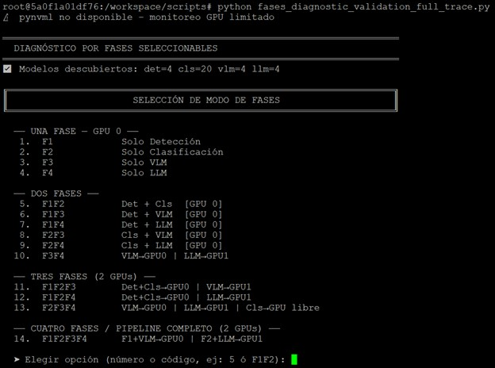

> Menú interactivo de selección del modo de fases. Permite elegir desde una fase individual (F1–F4) hasta el pipeline completo (F1F2F3F4) con asignación automática de GPUs recomendadas.

---

### 2 — Selección de Imágenes y Modelos Disponibles

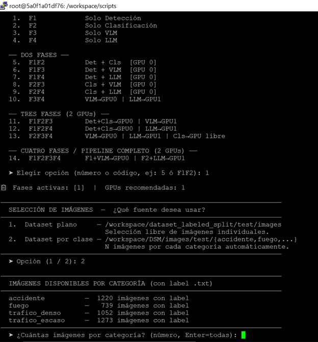

> Selección del dataset de evaluación (100 imágenes por categoría sobre el dataset DSM) y descubrimiento automático de modelos disponibles por fase: 14 modelos de detección, 20 de clasificación, 4 VLM y 4 LLM.

---

### 3 — Resumen de Selección y Confirmación

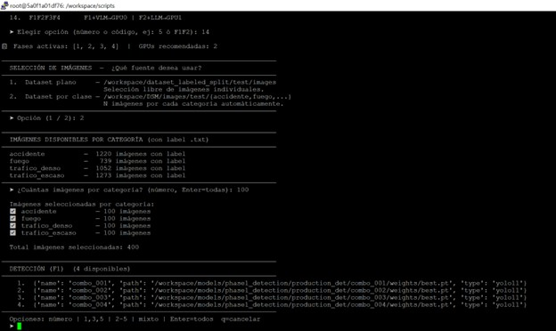
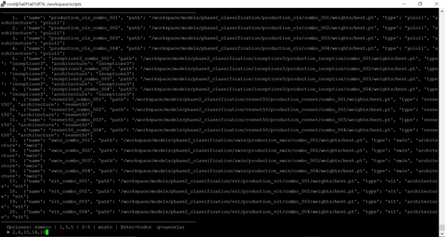
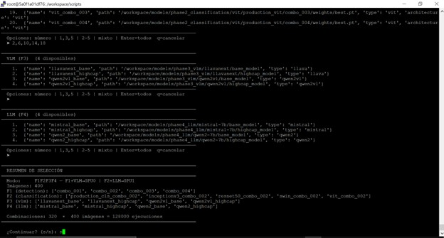
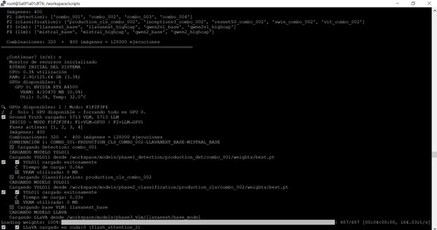

> Resumen previo a la ejecución mostrando los modelos seleccionados por fase, total de combinaciones a evaluar (320) y número total de ejecuciones (320 × 100 imágenes). La configuración óptima S1 emerge de este espacio de búsqueda exhaustivo.

---

### 4 — Suite Multiobjetivo MCDM-MODM (Pantalla Principal)

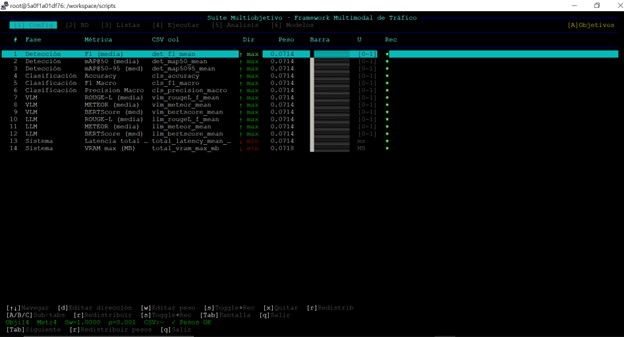

> Interfaz TUI de la Suite Multiobjetivo mostrando la tabla de comparación de métricas por combinación de pipeline. Las barras coloreadas indican el ranking relativo de cada configuración según los 7 métodos MCDM aplicados simultáneamente.

---

### 5 — Comparación S1 (Óptima) vs S2 (Robusta)

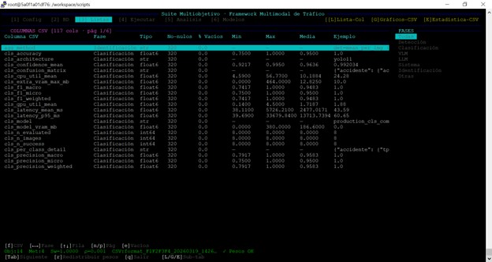
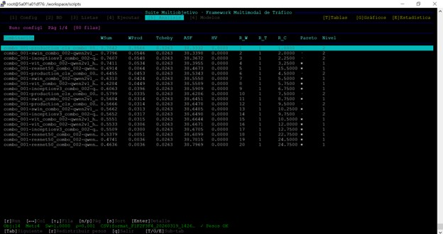
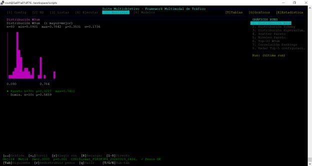
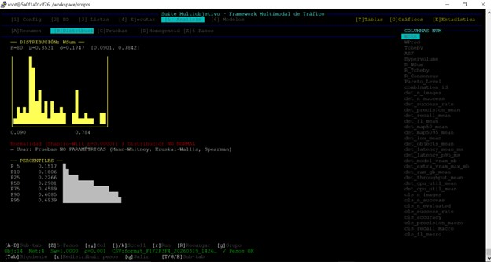
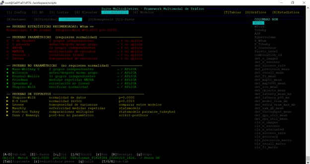
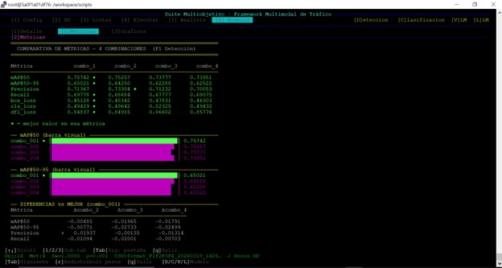
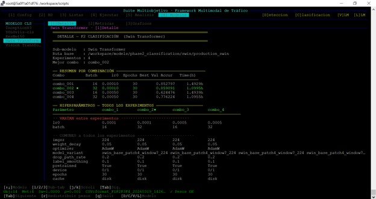
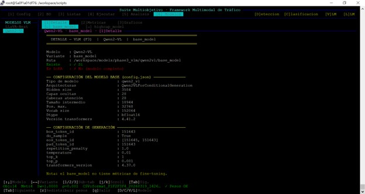

> Pantalla de gráficos ASCII de la Suite Multiobjetivo: comparación entre la configuración óptima S1 (`combo_002+Swin+qwen2vl_highcap+mistral_highcap`, BERTScore=0.8353) y la configuración robusta S2 (STD×DU mínimo). Las barras muestran la diferencia porcentual por métrica entre configuraciones.

---

### 6 — Visualización CSV con `csvreporte.sh`

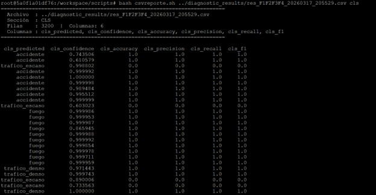
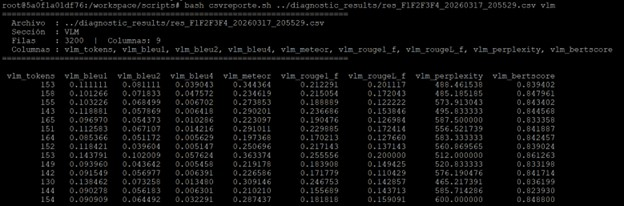
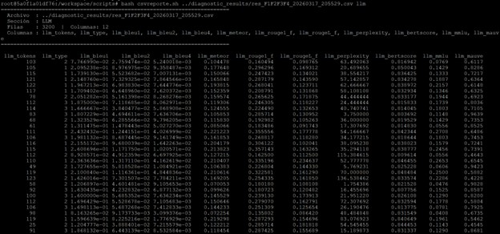

> Salida del script `csvreporte.sh` mostrando las métricas de la fase F1 (detección) para el CSV `F1F2F3F4_20240317_205529.csv`. Columnas visibles: `image_name, det_objects, det_precision, det_recall, det_f1, det_map_50, det_iou, det_latency_ms`.

---

## 🏆 Resultados Obtenidos

### Configuraciones identificadas por el Protocolo MCDM-MODM

| | S1 — Óptima (máx. rendimiento) | S2 — Robusta (máx. estabilidad) |
|--|-------------------------------|----------------------------------|
| **F1 — Detección** | combo_002 | combo_004 |
| **F2 — Clasificación** | Swin | Swin |
| **F3 — VLM** | qwen2vl_highcap | llavanext_highcap |
| **F4 — LLM** | mistral_highcap | mistral_highcap |
| **BERTScore F4** | **0.8353** | 0.8265 |
| **Consensus V2** | > 0.95 ✅ | > 0.95 ✅ |

### Hallazgos estadísticos clave

```
H1 — Fine-tuning supera baseline  : p < 0.05, Cohen d > 0.8 en F1, F2 y F3
H2 — Correlación F1-F3 con F4    : rho significativo, Rc1 > 0.90 (5 métodos)
H3 — Diferencia S1 vs S2         : PERMANOVA F=9.3025, p=0.001, R2=0.3992

Factor dominante del pipeline     : F3 — VLM (qwen2vl_highcap)
Componente invariante en F4       : mistral_highcap (presente en S1 y S2)

Correlaciones MCDM identificadas:
  WSum ≡ PROMETHEE  : rho = 1.000
  Tcheby perp ASF   : rho = 0.000
```

### Mejoras del fine-tuning sobre modelos base

| Fase | Métrica | Valor fine-tuneado | Mejora vs baseline |
|------|---------|-------------------|-------------------|
| F1 | mAP@50 | 0.7554 | +8.66% |
| F2 | F1-macro | 1.000 | — (Swin dominante) |
| F3 | BERTScore | 0.9047 | +7.77% |
| F3 | BLEU-4 | 0.2227 | +1526% vs S2 |
| F4 | BERTScore | 0.8391 | +1.52% vs S2 |

---

## 📂 Dataset DSM

El **Dataset Multimodal Especializado (DSM)** contiene imágenes de accidentes de tráfico vehicular anotadas en cuatro categorías con tres tipos de anotación:

| Categoría | Aprox. imágenes | Anotaciones incluidas |
|-----------|----------------|----------------------|
| `accidente` | 1,229 | Bounding box · Etiqueta · Descripción textual |
| `fuego` | 1,262 | Bounding box · Etiqueta · Descripción textual |
| `trafico_denso` | 1,051 | Bounding box · Etiqueta · Descripción textual |
| `trafico_escaso` | 1,275 | Bounding box · Etiqueta · Descripción textual |

**Formatos de anotación por fase:**

```
F1 — YOLO format
     label x_center y_center width height

F2 — ImageFolder format
     clase/imagen.jpg

F3 — Instrucción-respuesta
     {"instruction": "Describe...", "response": "descripción forense detallada"}
```

---

## 🔬 Protocolo Híbrido MCDM-MODM

```
ESPACIO DE BÚSQUEDA
320 configuraciones  (F1 × F2 × F3 × F4 = 2 × 5 × 4 × 4)
        │
        ▼
EVALUACIÓN EXHAUSTIVA
fases_diagnostic_validation_full_trace.py
Matriz de métricas: 320 filas × N métricas
        │
        ▼
7 MÉTODOS MCDM
multiobjective_suite.py
WSum · WProd · Tcheby · ASF · TOPSIS · ELECTRE III · PROMETHEE II
        │
        ▼
CRITERIO DE FILTRADO SECUENCIAL (6 pasos)
S1: Pareto 3D
S2: DU ≤ DŪ
S3: STD ≤ STD̄
S4: Consensus V2 ≤ P25
S5: PROMETHEE II ≤ P25
S6: min(STD × DU)
        │
        ├──► S1 — combo_002 + Swin + qwen2vl_highcap + mistral_highcap
        │         BERTScore = 0.8353  |  Consensus V2 > 0.95
        │
        └──► S2 — configuración robusta  (STD×DU mínimo)
                  Consensus V2 > 0.95
```

---

## 📖 Referencia Académica

Si utilizas este framework en tu investigación, por favor cita:

```bibtex
@phdthesis{framework_multimodal_trafico_2024,
  title  = {Framework Multimodal para el Análisis de Accidentes de Tráfico:
            Construcción del Dataset, Entrenamiento por Fases y Configuración
            de Rendimiento y Robustez mediante el Protocolo Híbrido MCDM-MODM},
  author = {Antonio},
  year   = {2024},
  school = {Universidad},
  type   = {Tesis Doctoral}
}
```

**Herramientas y frameworks referenciados:**

| Librería | Referencia |
|----------|-----------|
| YOLOv11 | Jocher et al. (2023) |
| Transformers | Wolf et al. (2020) |
| PEFT / LoRA | Hu et al. (2022) |
| BERTScore | Zhang et al. (2020) |
| MAUVE | Pillutla et al. (2021) |

---

## 📄 Licencia

Este proyecto está bajo la licencia MIT. Ver archivo [LICENSE](LICENSE) para más detalles.

---

<div align="center">

**Framework Multimodal para el Análisis de Accidentes de Tráfico**

*Investigación doctoral — Lima, Perú · 2024*

[](https://python.org)
[](https://pytorch.org)
[](https://developer.nvidia.com)

</div>
